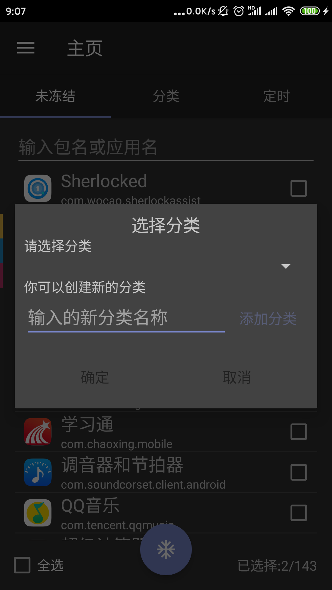
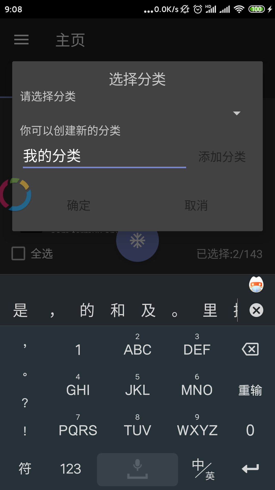
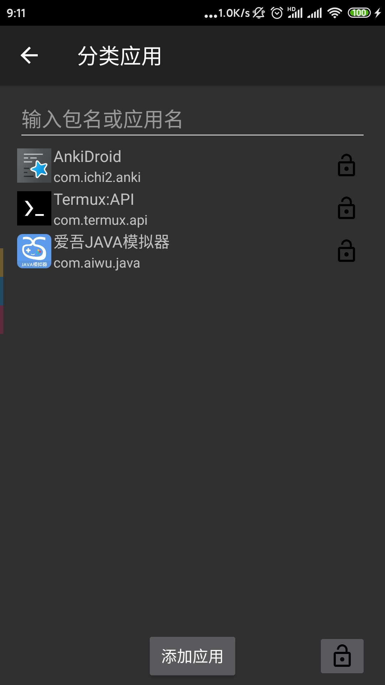
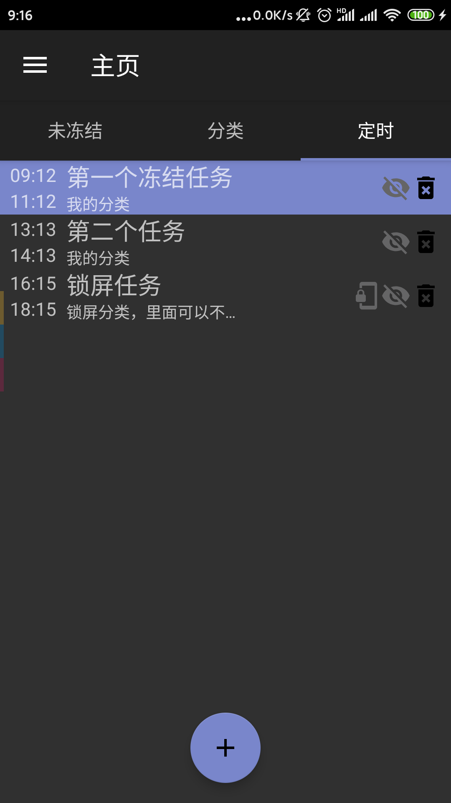
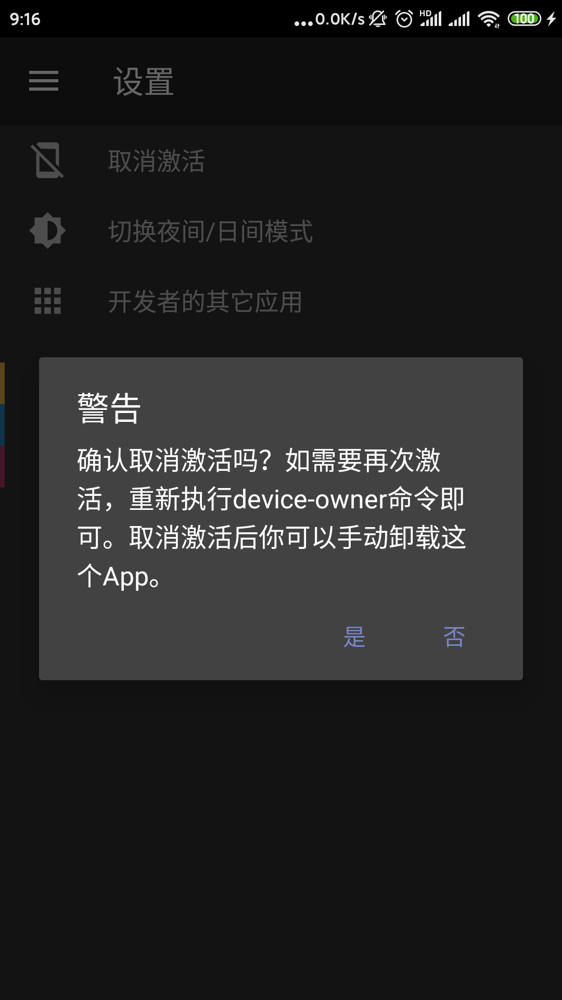
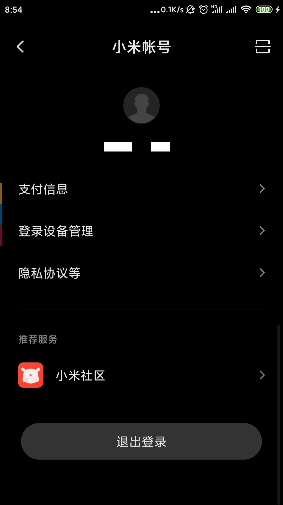
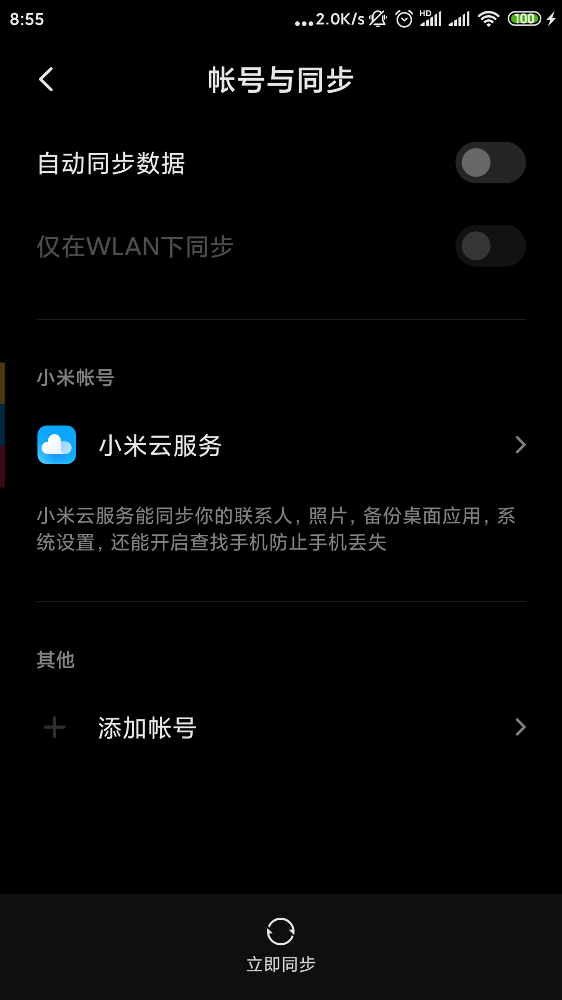
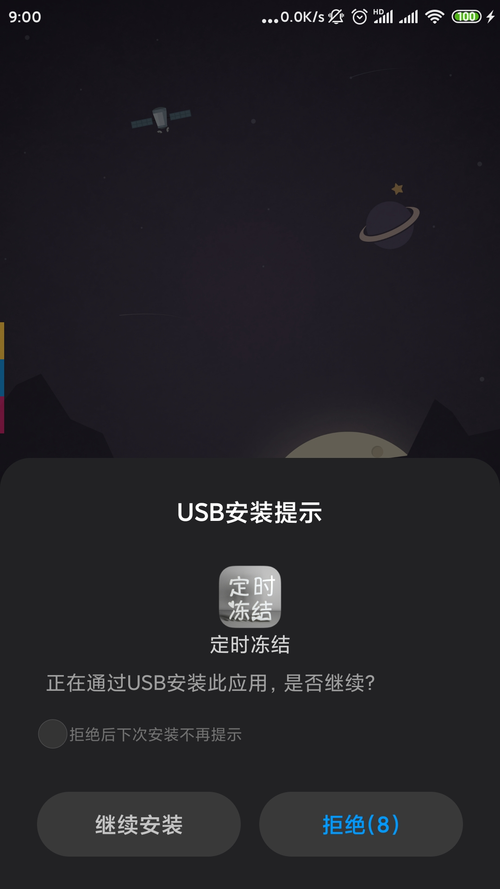

# 定时冻结

无需root，定时冻结应用或者锁定手机，侧重点在于在哪个时间段内冻结App和锁定手机，而不是App限制使用时长。

它并不是一个App管理器，当然你也可以这样用。

配合另一个App【[TimeLine App](https://github.com/tignioj/TimeLineApp)】，一起食用更佳，适合管不住自己玩手机的，或者本来查题目，查到着突然打开某某新闻，一个小时又过去了，忘记自己本来想干嘛。

# 截图

- 未激活

-[NO ACTIVATE](resources/imgs/device-2020-05-27-174714.png)

- 第一次冻结，选中app后，需要添加分类

;

- 添加分类



- 分类


- 分类下的App



- 首个任务


- 添加锁屏任务示例


- 任务列表



- 取消激活后，就可以卸载




# 特性

- 定时冻结应用
- 应用分类
- 无需root
- 可以自定义时间锁定手机

# 注意事项：
1. 一个应用只能属于一个分类
2. 如果你设置了锁定屏幕，你将无法在设置的时间内打开屏幕
3. 本应用会有BUG，由于BUG或者使用不当造成后果的自行承担(例如设置了24小时锁定屏幕)

# 为啥要用这个？

通常，手机占据了我们大部分的时间，以及各种各样的信息充斥着我们的大脑。我们需要安静一会儿。

# 如何安装?

因为它不需要Root权限，因此需要一些特殊的手段来激活这个应用

## 步骤一：下载Apk,*不能*直接安装到手机，你需要使用[adb工具](https://developer.android.com/studio/releases/platform-tools)

这是因为清单中设置了`testOnly="true"`

只有这样，才能更加方便卸载，否则如果app突然打不开，你将无法卸载

如果你发现你的可以直接安装，是酷安下载的，那是因为该的版本删去了`testOnly="true"`的代码。其实也是可以用的

不过我建议你把它卸载了, 不然到时候那天你打不开这个APP，就只能恢复出厂设置了, 之前我用一个App就是如此。刚授予权限就打不开，结果卸载也失败, 该开发者也停更了, 导致我最后只能恢复出厂设置。

去release下最新版，按照这里的教程走一遍。

因为单纯安装到手机意义不大，还需要激活。

## 步骤二：退出所有手机账户

- 在设置->账户 出退出你的所有账号，例如退出小米账号, 注意，是所有



- 账户与同步, 一个都不要留



- 建议先卸载支付宝，激活后再重新安装

## 步骤三：手机打开开发者模式，打开USB调试模式

- 这个不用多说了吧 设置->开发者选项->开启USB调试模式

## 步骤四：下载adb工具到电脑[adb工具](https://developer.android.com/studio/releases/platform-tools) ,并解压


- 去release下载[APK文件](https://github.com/tignioj/AutoFreezeApp/releases)

放到和adb解压后的同一个目录下，如图所示(我把它改名为app-release.apk)


## 步骤五：用adb工具连接手机

### 1) 显示设备
```
PS C:\Users\lili> adb devices
List of devices attached
ccbbee44        device
emulator-5554   device
```

### 2) 连接你的设备 `adb -s [你设备的id] shell `

```
PS C:\Users\lili> adb -s emulator-5554 shell
generic_x86_64:/ $
```

## 步骤六：通过adb移除手机中其它的账户
如果你看见除了0以外的其它账户，移除它，例如移除下面的999
```
generic_x86_64:/ $ pm list users
Users:
        UserInfo{0:Owner:13} running
        xxxxx {999:xxxx} ...
```
移除999账户
```
generic_x86_64:/ $ pm remove-user 999
```

只留下一个  (中文的是`UserInfo{0:机主:13}`，英文是`UserInfo{0:Owner:13}`)


## 步骤七：利用adb安装App, 并设置该App为管理员

### 1) 安装App
先退出shell, 再安装
```
generic_x86_64:/ $ exit
PS C:\Users\lili>  adb -s [你设备的id] install -t app-release.apk
Performing Streamed Install
Success
```
上面的命令手机可能弹出提示, 点击允许



## 2) 设置为管理员（关键)
```
PS C:\Users\lili>  adb -s [你设备的id] shell dpm set-device-owner com.tignioj.freezeapp/.MyDeviceAdminReceiver
Success: Device owner set to package ComponentInfo{com.tignioj.freezeapp/com.tignioj.freezeapp.MyDeviceAdminReceiver}
Active admin set to component {com.tignioj.freezeapp/com.tignioj.freezeapp.MyDeviceAdminReceiver}
```
如果出现错误
```
java.lang.IllegalStateException: Not allowed to set the device owner because there are already some accounts on the device
        at android.os.Parcel.createException(Parcel.java:1961)
        at android.os.Parcel.readException(Parcel.java:1921)
        at android.os.Parcel.readException(Parcel.java:1871)
        at android.app.admin.IDevicePolicyManager$Stub$Proxy.setDeviceOwner(IDevicePolicyManager.java:5863)
        at com.android.commands.dpm.Dpm.runSetDeviceOwner(Dpm.java:176)
        at com.android.commands.dpm.Dpm.onRun(Dpm.java:106)
        at com.android.internal.os.BaseCommand.run(BaseCommand.java:54)
        at com.android.commands.dpm.Dpm.main(Dpm.java:41)
        at com.android.internal.os.RuntimeInit.nativeFinishInit(Native Method)
        at com.android.internal.os.RuntimeInit.main(RuntimeInit.java:388)
Caused by: android.os.RemoteException: Remote stack trace:
        at com.android.server.devicepolicy.DevicePolicyManagerService.enforceCanSetDeviceOwnerLocked(DevicePolicyManagerService.java:7902)
        at com.android.server.devicepolicy.DevicePolicyManagerService.setDeviceOwner(DevicePolicyManagerService.java:7192)
        at android.app.admin.IDevicePolicyManager$Stub.onTransact(IDevicePolicyManager.java:1095)
        at android.os.Binder.execTransact(Binder.java:726)
        
```
表明步骤二和步骤六没做好

解决办法： 尝试卸载支付宝后，回到步骤六的2). 如果仍然没有出现Success, 请参考我下面给出的链接再去寻找解决办法, 或者贴出你的操作步骤到github的ISSUE


# 如何卸载？

## 方法一：
进入App，设置->取消激活，确认之后会提示: `管理员：未激活`, 这时候就可以直接卸载了


## 方法二：

(不适用于直接安装的用户)

1. 做上述同样的步骤直到第五步（包括第五步）以连接到手机

2. 执行命令
```
generic_x86_64:/ $ dpm remove-active-admin com.tignioj.freezeapp/.MyDeviceAdminReceiver
Success: Admin removed ComponentInfo{com.tignioj.freezeapp/com.tignioj.freezeapp.MyDeviceAdminReceiver}
```
未设置`testOnly=true`的会报错 `Attempt to remove non-test admin ComponentInfo` 
```shell
PS C:\Users\lili> adb -s  emulator-5554 shell  dpm remove-active-admin com.tignioj.freezeapp/.MyDeviceAdminReceiver
java.lang.SecurityException: Attempt to remove non-test admin ComponentInfo{com.tignioj.freezeapp/com.tignioj.freezeapp.MyDeviceAdminReceiver} 0
        at android.os.Parcel.createException(Parcel.java:2071)
        at android.os.Parcel.readException(Parcel.java:2039)
        at android.os.Parcel.readException(Parcel.java:1987)
        at android.app.admin.IDevicePolicyManager$Stub$Proxy.forceRemoveActiveAdmin(IDevicePolicyManager.java:8177)
        at com.android.commands.dpm.Dpm.runRemoveActiveAdmin(Dpm.java:222)
        at com.android.commands.dpm.Dpm.onRun(Dpm.java:121)
        at com.android.internal.os.BaseCommand.run(BaseCommand.java:56)
        at com.android.commands.dpm.Dpm.main(Dpm.java:41)
        at com.android.internal.os.RuntimeInit.nativeFinishInit(Native Method)
        at com.android.internal.os.RuntimeInit.main(RuntimeInit.java:338)
Caused by: android.os.RemoteException: Remote stack trace:
        at com.android.server.devicepolicy.DevicePolicyManagerService.forceRemoveActiveAdmin(DevicePolicyManagerService.java:4017)
        at android.app.admin.IDevicePolicyManager$Stub.onTransact(IDevicePolicyManager.java:3154)
        at android.os.Binder.execTransactInternal(Binder.java:1021)
        at android.os.Binder.execTransact(Binder.java:994)
```


## 参考教程

###  1）激活
https://www.jianshu.com/p/5b1a552b5040

http://floatingmuseum.github.io/2016/07/device-admin-practice

https://www.jianshu.com/p/8934d47aed3b

https://tieba.baidu.com/p/5751579349?red_tag=0005168206

### 2）取消激活

https://stackoverflow.com/questions/13911444/disable-deviceadmin-from-shell

https://stackoverflow.com/questions/51646153/remove-device-owner-android

