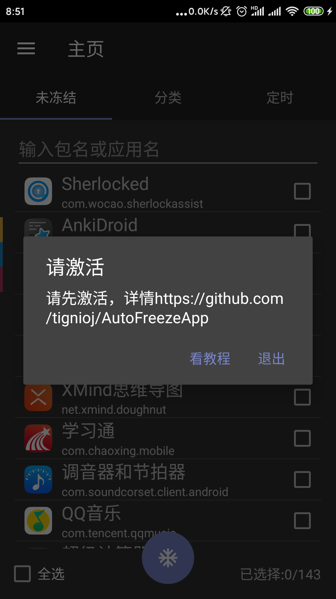

# AutoFreezeApp

Auto freeze my application or lock my phone without root.

# Screenshot





# Feature

- Customizable time to freeze application
- Application classification
- Without root
- Lock your phone at a custom time

# Notes:
1. An application can only belong to one category
2. If you set the lock screen, you will not be able to open the screen during the time you have set.
3. There will be bugs in this application, and the user shall bear the consequences caused by bugs or improper use (such as setting up a 24-hour lock screen).

# Why use it?

Usually, mobile phones take up most of our time, and all kinds of
information are flooding our brains. We need be quiet.

# How to use it?

Because it does not require root, it requires some special means of
activation

## Step1. install it to you PC, *DO NOT* install directly to the phone, you need to use adb tool.
Because testOnly="true" is set in AndroidManifest
Only in this way, can it be more convenient to uninstall, otherwise if the app suddenly does not open, you will not be able to uninstall

## Step2. Log out of all accounts in your phone.
Setting->Account

## Step3. Turn on develop options, turn on usb debug mode.

## Step4. Download adb tools to your computer.

## Step5. Connect to the phone using adb.

### 1) list devices

```
PS C:\Users\lili> adb devices
List of devices attached
ccbbee44        device
emulator-5554   device
```

### 2) connect to your phone. `adb -s [your device id] shell `

```
PS C:\Users\lili> adb -s emulator-5554 shell
generic_x86_64:/ $
```

## Step6. Remove other account from your phone using adb.
If you see accounts other than 0, remove them. For example, remove the 999 above
```
generic_x86_64:/ $ pm list users
Users:
        UserInfo{0:Owner:13} running
        xxxxx {999:xxxx} ...
```
remove account 999
```
generic_x86_64:/ $ pm remove-user 999
```

## Step7. Install application using adb, then set it to administrator
### 1) Install application
First exit shell, then install it
```
generic_x86_64:/ $ exit
PS C:\Users\lili>  adb -s [你设备的id] install -t app-release.apk
Performing Streamed Install
Success
```
## 2) Set it to administrator (Important)
```
PS C:\Users\lili>  adb -s [你设备的id] shell dpm set-device-owner com.tignioj.freezeapp/.MyDeviceAdminReceiver
Success: Device owner set to package ComponentInfo{com.tignioj.freezeapp/com.tignioj.freezeapp.MyDeviceAdminReceiver}
Active admin set to component {com.tignioj.freezeapp/com.tignioj.freezeapp.MyDeviceAdminReceiver}
```

If show error like this
```
java.lang.IllegalStateException: Not allowed to set the device owner because there are already some accounts on the device
        at android.os.Parcel.createException(Parcel.java:1961)
        at android.os.Parcel.readException(Parcel.java:1921)
        at android.os.Parcel.readException(Parcel.java:1871)
        at android.app.admin.IDevicePolicyManager$Stub$Proxy.setDeviceOwner(IDevicePolicyManager.java:5863)
        at com.android.commands.dpm.Dpm.runSetDeviceOwner(Dpm.java:176)
        at com.android.commands.dpm.Dpm.onRun(Dpm.java:106)
        at com.android.internal.os.BaseCommand.run(BaseCommand.java:54)
        at com.android.commands.dpm.Dpm.main(Dpm.java:41)
        at com.android.internal.os.RuntimeInit.nativeFinishInit(Native Method)
        at com.android.internal.os.RuntimeInit.main(RuntimeInit.java:388)
Caused by: android.os.RemoteException: Remote stack trace:
        at com.android.server.devicepolicy.DevicePolicyManagerService.enforceCanSetDeviceOwnerLocked(DevicePolicyManagerService.java:7902)
        at com.android.server.devicepolicy.DevicePolicyManagerService.setDeviceOwner(DevicePolicyManagerService.java:7192)
        at android.app.admin.IDevicePolicyManager$Stub.onTransact(IDevicePolicyManager.java:1095)
        at android.os.Binder.execTransact(Binder.java:726)
        
```
Indicate that steps 2 and 6 are not done, and refer to the links I give below to find a solution

Indicating that steps two and six were not done well

Solution: trying to uninstall `alipay`, go back to step 6 2). If `Success` still does not appear, please refer to the link below to find a solution, or post the steps to ISSUE

# How to uninstall it?

1. Do the same steps as above until step 5(include step5) to connect to
   your phone.
2. Run command

```
generic_x86_64:/ $ dpm remove-active-admin com.tignioj.freezeapp/.MyDeviceAdminReceiver
Success: Admin removed ComponentInfo{com.tignioj.freezeapp/com.tignioj.freezeapp.MyDeviceAdminReceiver}
```
then you can uninstall it.


## Reference

###  1）Activate
https://www.jianshu.com/p/5b1a552b5040

http://floatingmuseum.github.io/2016/07/device-admin-practice

https://www.jianshu.com/p/8934d47aed3b

https://tieba.baidu.com/p/5751579349?red_tag=0005168206

### 2）Deactivate

https://stackoverflow.com/questions/13911444/disable-deviceadmin-from-shell

https://stackoverflow.com/questions/51646153/remove-device-owner-android

